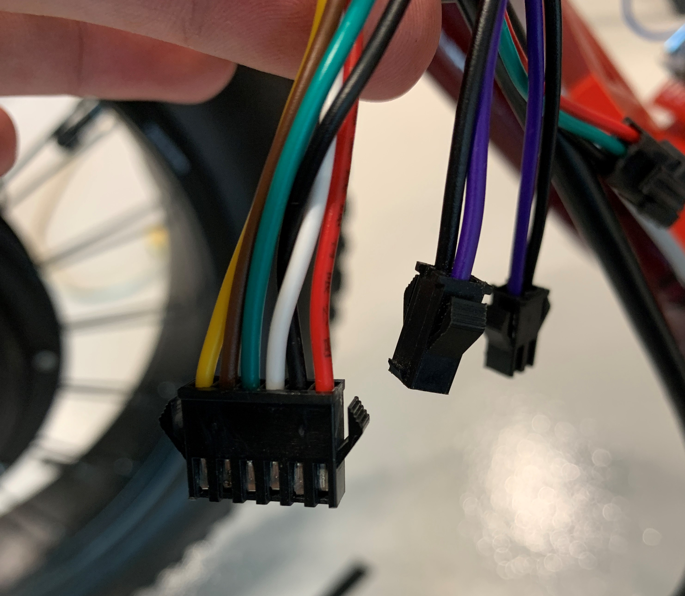

# Bikebot
In development

# Hardware

* Actuation Motors and Controllers
    * 2x [AW 16.5" Electric Bicycle Front Wheel Frame Kit for 20" 48V 1000W 470RPM E-Bike](https://www.amazon.com/gp/product/B01C6QZ0IM/ref=ppx_yo_dt_b_asin_title_o02_s00?ie=UTF8&psc=1)
    * 2x 45 KG Servos for disc brake actuation
    * 3x [FY56EL500BC1](https://www.alibaba.com/product-detail/Nema-23-1-5N-m-Closed_62096104987.html) closed loop stepper motors
    * 3x [FYDB506T](https://www.yoycart.com/Product/541066463808/) closed loop stepper motor drivers
    * 3x gearbox reducers
    
    * [T032 48v Lithium ion Battery](http://www.twistidea.com/manual/t032-48v-battery-owners-manual/)
* Electronics
  * IMU800 Inertial Measurement Unit from Motion Sense Inc
  * Custom embedded system based on 2 [Teensy 4.0 microcontroller development boards](https://www.pjrc.com/store/teensy40.html)

FY56EL500BC1 Stepper Specs | Value
------------ | -------------
Frame Size | NEMA 23
Step Angle | 1.8deg
Step Angle  Accuracy | 	±5%(Full step,no load)
Radial Maximum Load | 75N
Holding Torque | 1.5N⋅m or 214.29oz/in
Current / Phase | 	5.0A
Length | 76mm
Weight | 1.0Kg

FYDB506T Closed Loop Stepper Driver | Value
------------ | -------------
DC In | 24-50v
Input Control Signal Voltage | 1.8-5.0v
Pulse Input Frequency | 0-200kHz
Pulse Input Width | 2.5μS
Current / Phase | 2.0~6.0A Automatic adjustment
Maximum Pulse Frequency | 250 Kpps
Weight | 0.32Kg

Wheel hub Motor Controller | Value
------------ | -------------
DC In | 48v
Throttle Input Range | 1.25-3.3v<
Power Output | 1000W 26A

Wheel Hub BLDC Motor | Value
------------ | -------------
Motor Voltage | 48V
Rotating Speed | 480 RPM
Efficiency | 80%
Overall Dimension | 16 9/16" x 3 1/4" (42 x 8.3 cm)
Axle Length | 7 13/16" (19.8 cm)
Front Dropout Spacing | 5 5/16" (13.5 cm)

## Wiring
***

### The Wiring for the Wheel hub Motor Controller

Wire | Function
------------ | -------------
Yellow & Brown | Used to enable controller (close to enable)
Green | 48v from battery. Can be used to monitor battery level
White | Throttle Signal, range from 1.25v to 3.3v<
Black | Ground
Red | 5.0V, can be used to power some electronics if needed
Black & Purple | Safety Disable, either pairs of these cables can be closed to disable the controller